# Disco-Musica System Flows

## Overview

This document describes the key operational flows in the Disco-Musica system, focusing on data management, analytics, and music generation processes.

## Core Flows

### Data Management Flows

#### 1. Time Series Data Management

The time series data management flow handles performance metrics and model training history:

1. **Data Collection**
   - Collect metrics from various system components
   - Store data points with timestamps
   - Associate metadata with metrics

2. **Data Processing**
   - Aggregate data at different intervals
   - Clean and validate data points
   - Handle missing or invalid data

3. **Data Analysis**
   - Detect patterns (seasonal, cyclic, trend)
   - Analyze correlations between metrics
   - Generate insights and forecasts

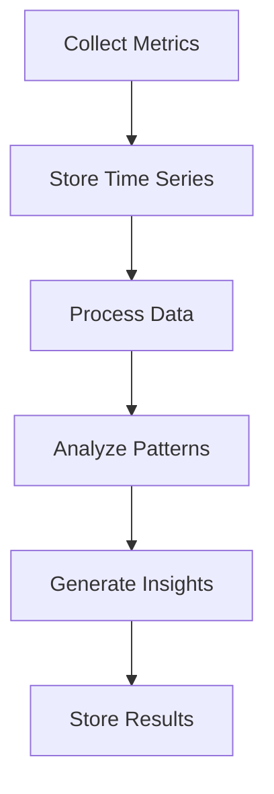

#### 2. Vector Data Management

The vector data management flow handles embeddings and similarity search:

1. **Embedding Generation**
   - Generate embeddings from various inputs
   - Store embeddings with metadata
   - Index for fast retrieval

2. **Search Operations**
   - Process search queries
   - Find similar items
   - Rank and filter results

3. **Analysis**
   - Cluster similar items
   - Analyze relationships
   - Generate recommendations

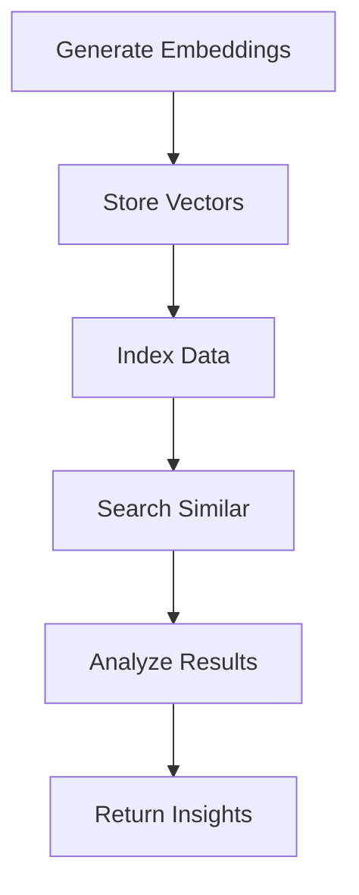

### Analytics Flows

#### 1. Performance Analysis

The performance analysis flow tracks and analyzes system metrics:

1. **Metric Collection**
   - Collect performance data
   - Store in time series format
   - Track metadata and context

2. **Pattern Detection**
   - Analyze trends
   - Detect anomalies
   - Identify correlations

3. **Insight Generation**
   - Generate reports
   - Trigger alerts
   - Update dashboards

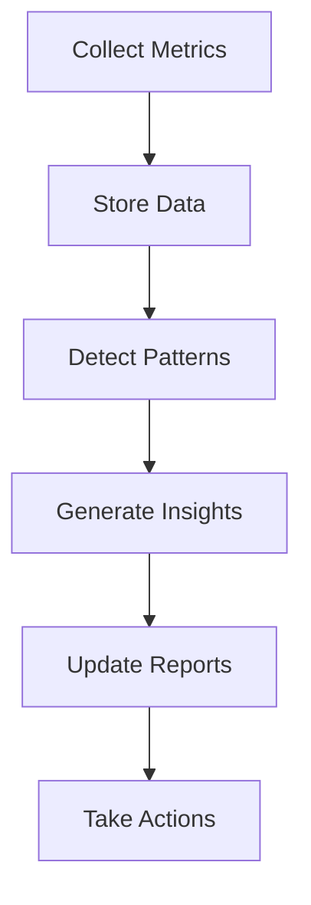

#### 2. Model Analysis

The model analysis flow tracks and analyzes model performance:

1. **Training Metrics**
   - Collect training data
   - Track loss and accuracy
   - Monitor resource usage

2. **Performance Analysis**
   - Analyze learning curves
   - Detect training issues
   - Compare models

3. **Optimization**
   - Suggest improvements
   - Adjust parameters
   - Update models

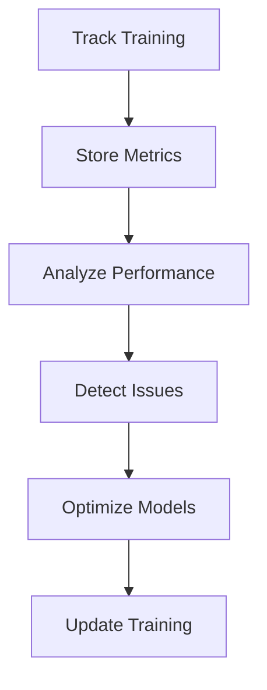

### Music Generation Flows

#### 1. Text-to-Music Generation

The text-to-music generation flow creates music from text descriptions:

1. **Input Processing**
   - Parse text description
   - Extract musical parameters
   - Generate embeddings

2. **Music Generation**
   - Select appropriate model
   - Generate music
   - Apply effects

3. **Post-processing**
   - Format output
   - Apply mastering
   - Store results

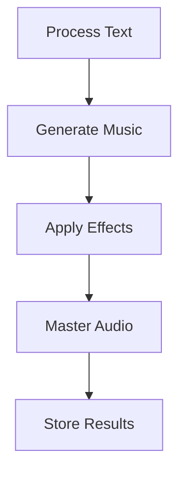

#### 2. Audio Processing

The audio processing flow handles audio manipulation and enhancement:

1. **Audio Analysis**
   - Analyze input audio
   - Extract features
   - Detect characteristics

2. **Processing**
   - Apply effects
   - Adjust parameters
   - Enhance quality

3. **Output Generation**
   - Format audio
   - Apply mastering
   - Store results

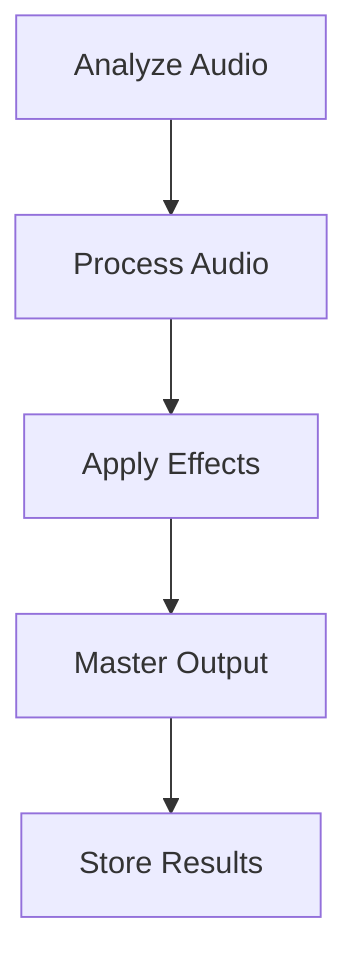

## Integration Flows

### Logic Pro Integration

The Logic Pro integration flow manages DAW communication:

1. **Plugin Communication**
   - Handle plugin messages
   - Process commands
   - Return results

2. **Data Exchange**
   - Transfer audio data
   - Share parameters
   - Sync state

3. **Control Flow**
   - Handle user actions
   - Update UI
   - Manage resources

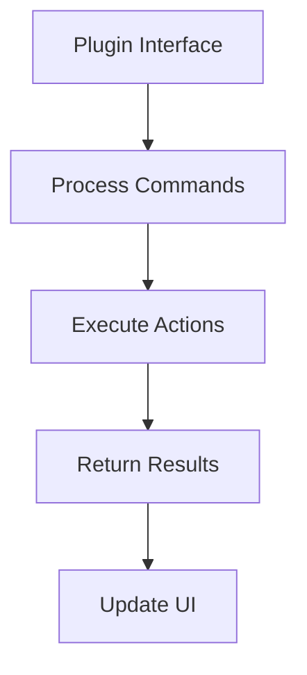

## Data Analysis Flows

### Time Series Analysis

The time series analysis flow processes temporal data:

1. **Data Preparation**
   - Load time series
   - Clean data
   - Align series

2. **Analysis**
   - Detect patterns
   - Calculate correlations
   - Generate forecasts

3. **Results**
   - Store analysis
   - Generate reports
   - Update visualizations

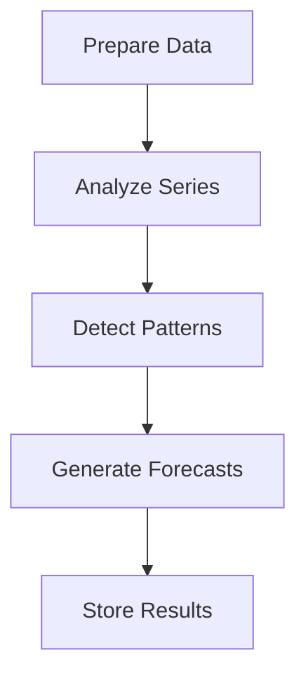

### Vector Analysis

The vector analysis flow processes embeddings:

1. **Vector Processing**
   - Generate embeddings
   - Index vectors
   - Prepare queries

2. **Analysis**
   - Search similar
   - Cluster vectors
   - Analyze relationships

3. **Results**
   - Rank results
   - Filter outputs
   - Store analysis

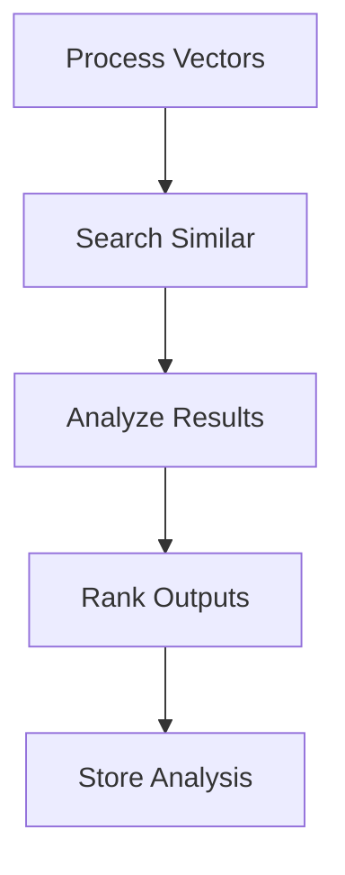

## Error Handling

All flows include comprehensive error handling:

1. **Error Detection**
   - Validate inputs
   - Check parameters
   - Monitor execution

2. **Error Response**
   - Log errors
   - Handle exceptions
   - Return status

3. **Recovery**
   - Retry operations
   - Clean up resources
   - Restore state

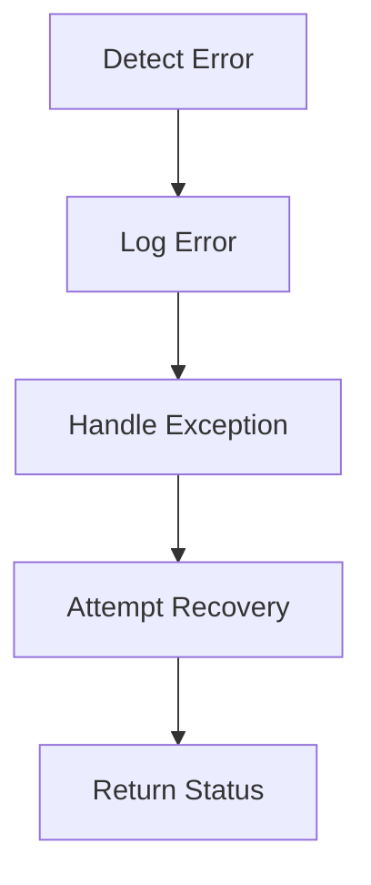

## Performance Optimization

All flows implement performance optimization:

1. **Resource Management**
   - Pool connections
   - Cache results
   - Optimize memory

2. **Batch Processing**
   - Group operations
   - Parallel execution
   - Resource sharing

3. **Monitoring**
   - Track metrics
   - Monitor resources
   - Optimize usage

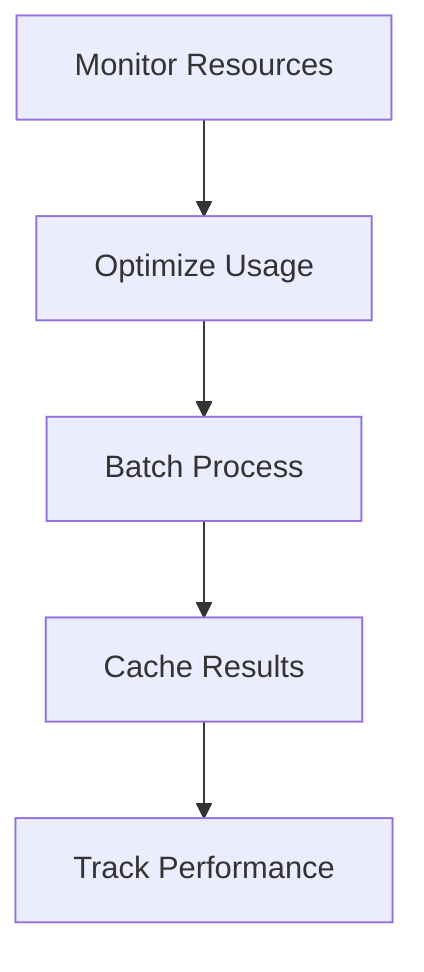